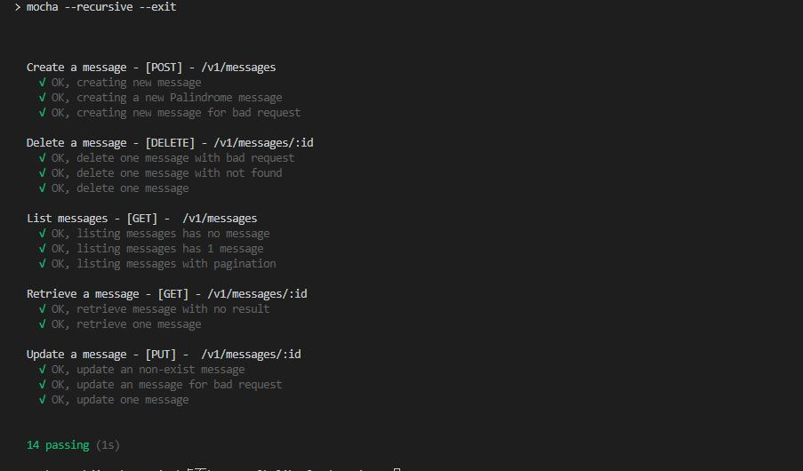
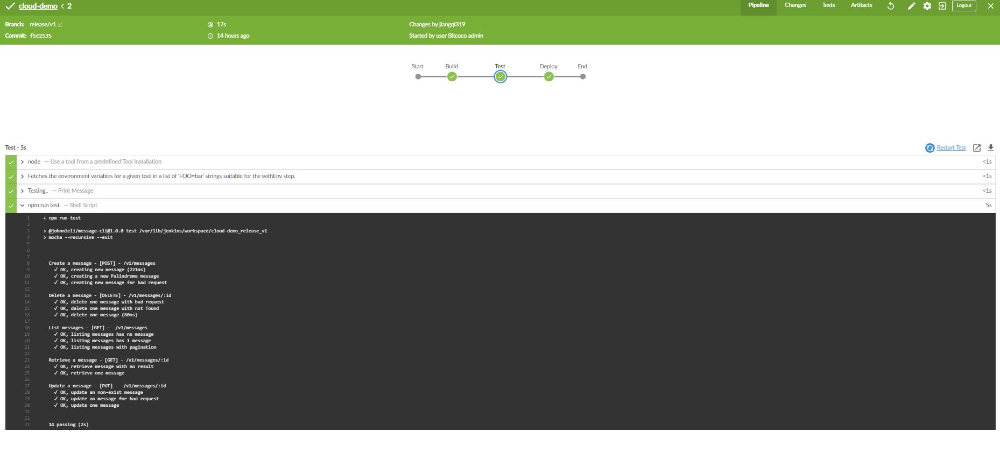
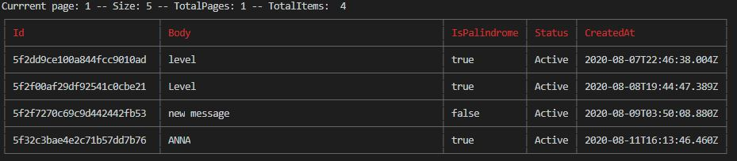

# Cloud Audition Project
##### This is a simple REST API in NodeJs 
service around message resource, which can list, create, retrieve, update and delete a message.
##### Deployed in AWS and using Kubernetes, Jenkin involved. CLI is available as well
##### Author: Jiangqi Li  <jiangqi.li@outlook.com>
##### Repository: https://github.com/JohnnieLi/cloud-demo
##### Live API Link: https://api.johnnieli.com/v1/messages
##### Live API Doc: https://api.johnnieli.com/api-docs 
##### Live Readme Web Doc: https://api.johnnieli.com/readme/
***
## API Code Structure sample from **src/app**
```
app
├── @core
|   |──utils
|
├── api.v1 (defined API routes here)
|
├── controllers
|   ├── message.controller.js
|   └── ...
|
├── _models
|   ├── Message.js
|   └── ...
├── ...
|
└── app.js
```
##### The API Code structure has controller, model modules and connect to mongoDb database by mongoose.
**@Core module** will hold any shared helpers, such as the stringHelper which has isPalindrome().
***
## Build, test, run and deployment
1. Clone from the repository https://github.com/JohnnieLi/cloud-demo,
2. go to dictory /cloud-demo
3. Install packages
```
npm install
```
4. run test: Tips: testing is using MongoDB in memory
```
npm run test
```
5. Run locally (add .env file which has `DB_DEV=VALUE` to hold the live DB credential)
```
npm start
```
6. `Run locally alternatively` Since the security considerations, author doesn't push the .env file to public github repository, if missing .env file, please run locally by docker
```
docker-compose up
```

When run locally. you can now access the service by http://localhost:8080
the api docs will available from http://localhost:8080/api-docs


7. Deployment: 
Go to your server and follow the above steps, then run in production mode
```
npm run prod
```
or
```
docker-compose up
```

Tips: Author is using Kubernetes and AWS services to deploy this API service as https://api.johnnieli.com, more details will be shown later.


***
## Tesing Capture
1. Using Chai test framework to test the message api
2. Using MongoMemoryServer as testing db env
```
npm run test
```



***
## API Docs
More details please check https://api.johnnieli.com/api-docs

HOST:    https://api.johnnieli.com

Endpoints:
```
 POST    /v1/messages
 GET     /v1/messages/:id
 PUT     /v1/messages/:id
 DELETE  /v1/messages/:id
 GET     /v1/messages
```

List all messages with pagination 
```
curl -X GET https://api.johnnieli.com/v1/messages?page=1&size=10
```

List all messages without pagination
```
curl -X GET https://api.johnnieli.com/v1/messages
```

Retrieve one message by id
```
curl -X GET https://api.johnnieli.com/v1/messages/5f2dd9ce100a844fcc9010ad
```

Create a message
```
curl -X POST https://api.johnnieli.com/v1/messages -d body="My Test Message (created for API docs)"
```

Update a message
```
curl -X PUT https://api.johnnieli.com/v1/messages/5f32c4e0e4e2c7487add7b77 -d body="My Test Message updated (created for API docs)"
```

Delete a message
```
curl -X DELETE https://api.johnnieli.com/v1/messages/5f32c4e0e4e2c7487add7b77
```


***
## AWS, kubernetes Deployment
1. Launch a EC2 instance to install the `kops`
2. Create IAM user for `kops` usage
3. Register dns domain on Route 53
4. Create a S3 for `kops`
5. Build a docker image and push it to docker hub as public image: `jiangqi319/cloud-demo`
6. Using kops to create a kubenetes cluster in aws (set dns-zone as registered one)
7. Using kubectl to create a deployment and expose it as the service based on the yml file (using docker image `jiangqi319/cloud-demo` and service kind is: loadbalance)
8. Create a public certificate for `api.johnnieli.com` using AWS Certificate Manager
9. Create a CloudFront Distribution with loadbalancer and apply the domain `api.johnnieli.com` in with AWS Certificate, disabled the http cache on purpose.
10. https://api.johnnieli.com are available now.


***
## CI: Jenkins
1. Deployment a Jenkin service and install github related plugins
2. create a `Jenkinsfile` on the project and defined the stages
```
pipeline {
  agent any
  tools {nodejs "node"}
  stages {
    stage('Build') {
      steps {
        echo 'Building..'
        sh 'npm install'
      }
    }

    stage('Test') {
      steps {
        echo 'Testing..'
        sh 'npm run test'
      }
    }

    stage('Deploy') {
      steps {
        echo 'Deploying 1/2....'
      }
    }

  }
} 
```
3. This demo is testing only, so the author don't put any deployment stage here.
4. The Jenkins will be triggered and run test on jenkins enviornment workspace.




***
## CLI: Command Interface
1. Demo purpose： name the bin code as `johnnieliMessage`
2. locally, run
```
npm link
```
3. then can use `johnnieliMessage` command, type `johnnieliMessage --help` see details
```
johnnieliMessage [command] <options>
  ls ................ show all messages
  ps ........... show one message by id
  create.............. create a new message 
  update ............ update the existing message by id
  rm ............ delete a message by id
  help ............... show help menu for a command    
```
4. `johnnieliMessage create --help` also available to check
```
  johnnieliMessage create <options>
  --body, -b ....... add the message content as the body.
```
5. `johnnieliMessage ls -p 1 -s 5` will show as below:




***
Website readme: https://api.johnnieli.com/readme/